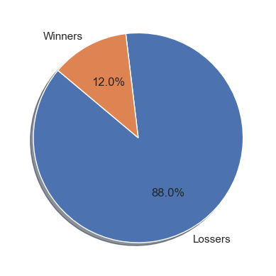

# Python Betfair Dataset Analytics

This project explores how the chance of winning a bet is affected not only by the decimal odds, but by various other variables as well. Its analysis is built using one week's worth of data from the Betfair platform from early September, 2014. Our team consists of Nathan Stevens, Sarah Demmon, Paola Roman, and Pedro Siqueira.

## Introduction

Sports betting is a huge industry with a global market value (2023) of $105B and it continues to grow as more countries legalize and adopt this industry. The rise in popularity of mobile sports betting and the innovation of new products in the industry has contributed to an annual growth rate of 8.2%. The industry is segmented into two major betting categories. Fixed-odds in which users place bets with a bookmaker and a betting exchange where users bet against each other. This industry makes extensive use of big data and analytics to drive engagement and hence profit growth. Among betting exchanges, Betfair is the largest in the world with over 4 million customers and $6B a week in transactions. 

## Data Cleaning/Transformation

The dataset consists of 1.3M records of betting outcomes for 23 different sports/events taking place around the globe over the course of one week in early September 2014. The original dataset can be found on [Kaggle](https://www.kaggle.com/datasets/zygmunt/betfair-sports). Primary data cleaning steps consist of:
1. Dropping rows with empty values
2. Filter rows by the 6 sports of interest 
3. Add 2 columns to track total wins and losses amount for bet
4. Extract the the sport games to csv files and manually add country and city
5. Add latitude, longitude, and weather using appropriate APIs.  
6. Finally merge exported csv back into main dataset adding columns to track location and weather information

## Key Questions Studied
* If one was to bet on an underdog, how does that affect one’s chances of winning?
* Is there any correlation between number of bets and average amount won/loss?
* Are there any correlations between amount of money won/loss and sport?
* Are there any differences between sport and number of bets won for favorites/underdogs?
* Are there any correlations between chance of winning and bet type?
* Are there any correlations between weather/location and amount won/loss?

#### Chance of Winning vs Underdog Bet
Overall the chance of winning drops to on 12 percent when underdog bets (decimal odds greater than 3.3) are placed vs 62 percents for betting on the favorites.

Additionally, plotting percentage of winning bets vs decimal odds clearly shows that there is a drastic decrease (exponential) in probability of winning as the odds increase. Moreover, the average money loss betting on an underdog sees a near linear increase as the odds increase.

    

#### Number of Bets vs. Average Amount Won/Loss
To study the relationship between number of bets and the amount of money won loss scatter plots of average amount won/loss were created with linear regression lines. For average winnings vs number of bets there does appear to be a weak correlation. For average losses that correlation is even weaker.

#### Sport vs Average Amount Won/Loss
Each sport had its own different range of win and loss amounts. A notable data point would be how golf has the largest range of amount lost out of all the tested sports. 

#### Sport vs Number Of Bets Won For Favorites and Underdogs
While favorites had no clear difference between the amount of winners, underdogs had the lowest win flags in golf and cricket. These results were verified by doing an ANOVA analysis.

#### Chance of Winning and Bet Type
For favorites, there was not much of a difference between the type of bet placed and number of winners. For underdogs, the "First Half" bet type had a higher win percentage, while "Winner" and "Correct Score" were the lowest win percentage. Again, ANOVA analysis was done to verified that there are in fact statistically significant differences.

#### Weather/Location and Amount Won/Loss
There was no correlation between temperature or rain and winning/lossing bets.
 

#### Location vs Winning Bets
There was no correlation between location and winning bets especially when looking at underdog bets. For favorites, there does seem to locations where there were more winners than lossers, but that's likely random chance, and more data would prove this wrong.
 

## Conclusion
The data showed that betting on underdogs yields a significantly higher chance of a losing bet. There was no correlation between weather, location  and winning bets. Betting on different sports will not significantly affect chances of winning. Similar trend was observed for the different bet types. 

Because sports betting is a rapidly changing field, more data sets with more values are needed to understand the relationship between the features. The addition of machine learning models would provide further insights into those relationships.